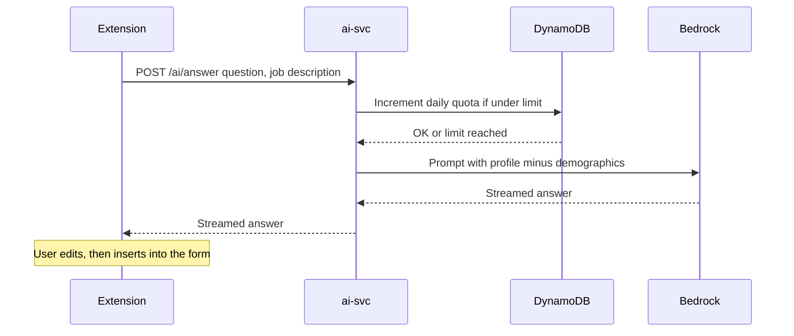

# Flow - AI answer

Feature: [[F04 AI Answers and Match Score]] · back to [[00 Home]]

```mermaid
sequenceDiagram
    participant X as Extension
    participant I as ai-svc
    participant D as DynamoDB
    participant B as Bedrock
    X->>I: POST /ai/answer question, job description
    I->>D: Increment daily quota if under limit
    D-->>I: OK or limit reached
    I->>B: Prompt with profile minus demographics
    B-->>I: Streamed answer
    I-->>X: Streamed answer
    Note over X: User edits, then inserts into the form
```
