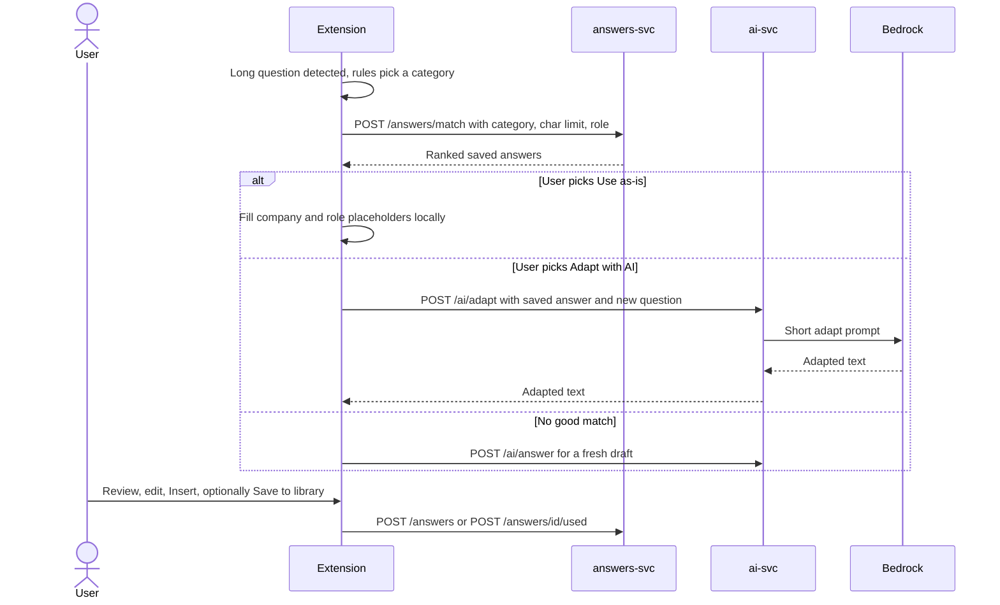

# Flow - Answer from library

Feature: [[F11 Answer Library]] · back to [[00 Home]]

```mermaid
sequenceDiagram
    actor U as User
    participant X as Extension
    participant L as answers-svc
    participant I as ai-svc
    participant B as Bedrock
    X->>X: Long question detected, rules pick a category
    X->>L: POST /answers/match with category, char limit, role
    L-->>X: Ranked saved answers
    alt User picks Use as-is
        X->>X: Fill company and role placeholders locally
    else User picks Adapt with AI
        X->>I: POST /ai/adapt with saved answer and new question
        I->>B: Short adapt prompt
        B-->>I: Adapted text
        I-->>X: Adapted text
    else No good match
        X->>I: POST /ai/answer for a fresh draft
    end
    U->>X: Review, edit, Insert, optionally Save to library
    X->>L: POST /answers or POST /answers/id/used
```
