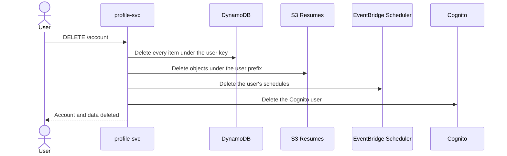

# Flow - Delete account

Feature: [[F01 Accounts and Profile Sync]] · back to [[00 Home]]

```mermaid
sequenceDiagram
    actor U as User
    participant P as profile-svc
    participant D as DynamoDB
    participant S as S3 Resumes
    participant E as EventBridge Scheduler
    participant C as Cognito
    U->>P: DELETE /account
    P->>D: Delete every item under the user key
    P->>S: Delete objects under the user prefix
    P->>E: Delete the user's schedules
    P->>C: Delete the Cognito user
    P-->>U: Account and data deleted
```
