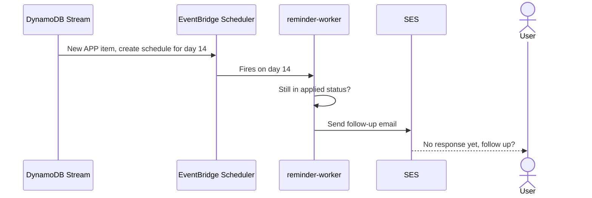

# Flow - Follow-up reminder

Feature: [[F08 Follow-up Reminders]] · back to [[00 Home]]

```mermaid
sequenceDiagram
    participant D as DynamoDB Stream
    participant E as EventBridge Scheduler
    participant W as reminder-worker
    participant M as SES
    actor U as User
    D->>E: New APP item, create schedule for day 14
    E->>W: Fires on day 14
    W->>W: Still in applied status?
    W->>M: Send follow-up email
    M-->>U: No response yet, follow up?
```
