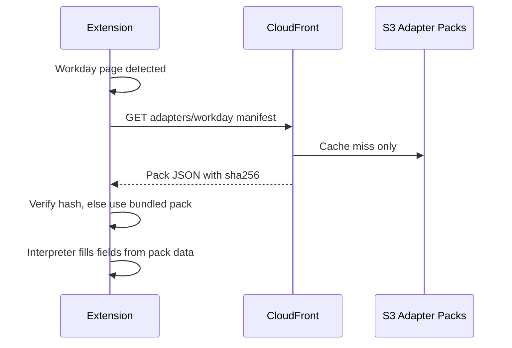

# Flow - Load adapter pack

Feature: [[F06 Remote Adapter Packs]] · back to [[00 Home]]

```mermaid
sequenceDiagram
    participant X as Extension
    participant CF as CloudFront
    participant S as S3 Adapter Packs
    X->>X: Workday page detected
    X->>CF: GET adapters/workday manifest
    CF->>S: Cache miss only
    CF-->>X: Pack JSON with sha256
    X->>X: Verify hash, else use bundled pack
    X->>X: Interpreter fills fields from pack data
```
