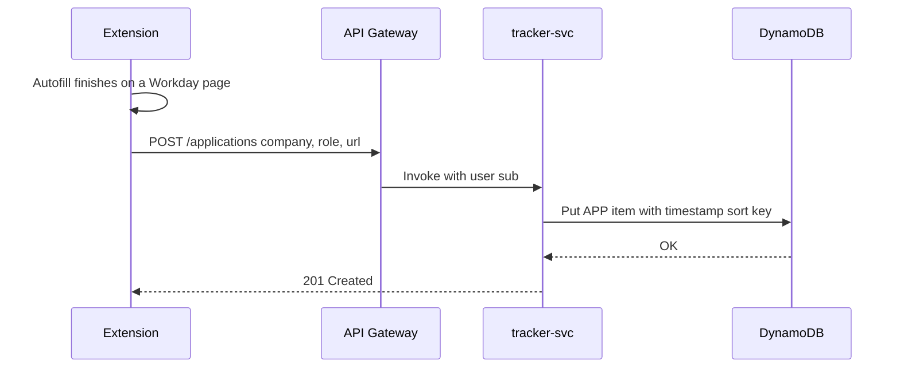

# Flow - Log an application

Feature: [[F05 Application Tracker]] · back to [[00 Home]]

```mermaid
sequenceDiagram
    participant X as Extension
    participant A as API Gateway
    participant T as tracker-svc
    participant D as DynamoDB
    X->>X: Autofill finishes on a Workday page
    X->>A: POST /applications company, role, url
    A->>T: Invoke with user sub
    T->>D: Put APP item with timestamp sort key
    D-->>T: OK
    T-->>X: 201 Created
```
