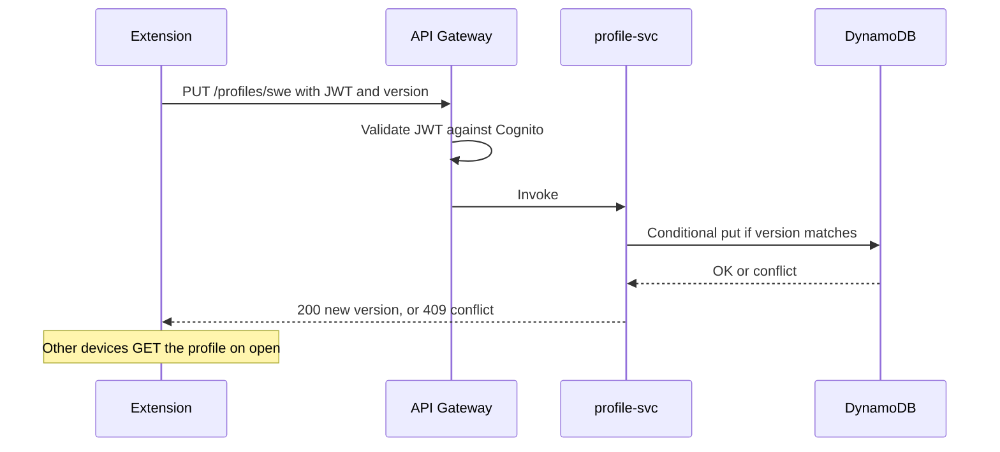

# Flow - Profile sync

Feature: [[F01 Accounts and Profile Sync]] · back to [[00 Home]]

```mermaid
sequenceDiagram
    participant X as Extension
    participant A as API Gateway
    participant P as profile-svc
    participant D as DynamoDB
    X->>A: PUT /profiles/swe with JWT and version
    A->>A: Validate JWT against Cognito
    A->>P: Invoke
    P->>D: Conditional put if version matches
    D-->>P: OK or conflict
    P-->>X: 200 new version, or 409 conflict
    Note over X: Other devices GET the profile on open
```
