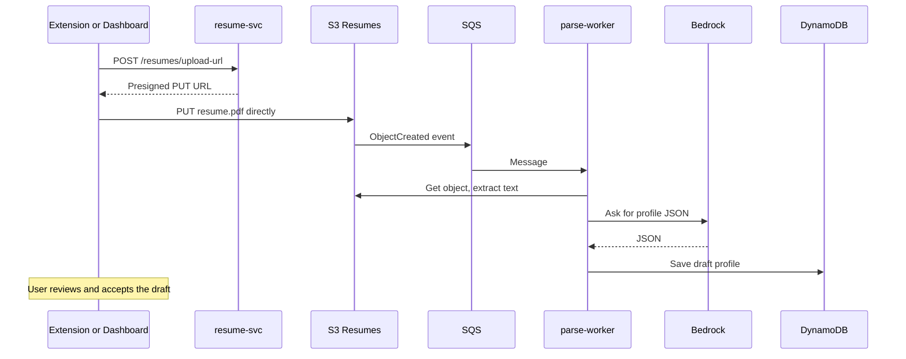

# Flow - Resume upload and parse

Feature: [[F03 Resume Parsing]] · back to [[00 Home]]

```mermaid
sequenceDiagram
    participant X as Extension or Dashboard
    participant R as resume-svc
    participant S as S3 Resumes
    participant Q as SQS
    participant W as parse-worker
    participant B as Bedrock
    participant D as DynamoDB
    X->>R: POST /resumes/upload-url
    R-->>X: Presigned PUT URL
    X->>S: PUT resume.pdf directly
    S->>Q: ObjectCreated event
    Q->>W: Message
    W->>S: Get object, extract text
    W->>B: Ask for profile JSON
    B-->>W: JSON
    W->>D: Save draft profile
    Note over X: User reviews and accepts the draft
```
