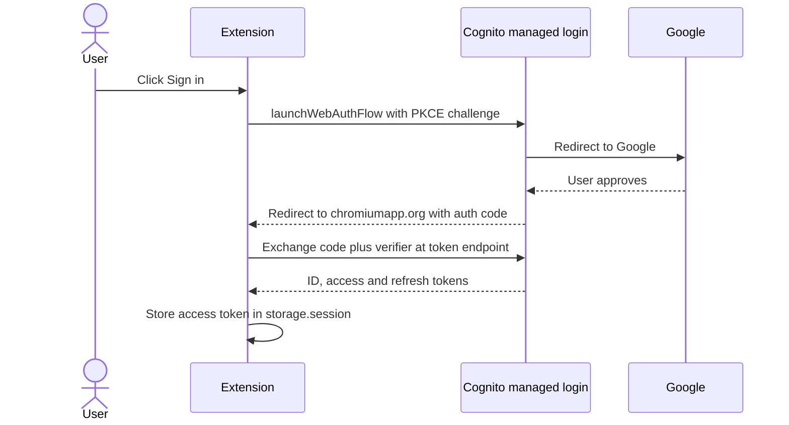

# Flow - Sign in

Feature: [[F01 Accounts and Profile Sync]] · back to [[00 Home]]

```mermaid
sequenceDiagram
    actor U as User
    participant X as Extension
    participant C as Cognito managed login
    participant G as Google
    U->>X: Click Sign in
    X->>C: launchWebAuthFlow with PKCE challenge
    C->>G: Redirect to Google
    G-->>C: User approves
    C-->>X: Redirect to chromiumapp.org with auth code
    X->>C: Exchange code plus verifier at token endpoint
    C-->>X: ID, access and refresh tokens
    X->>X: Store access token in storage.session
```
