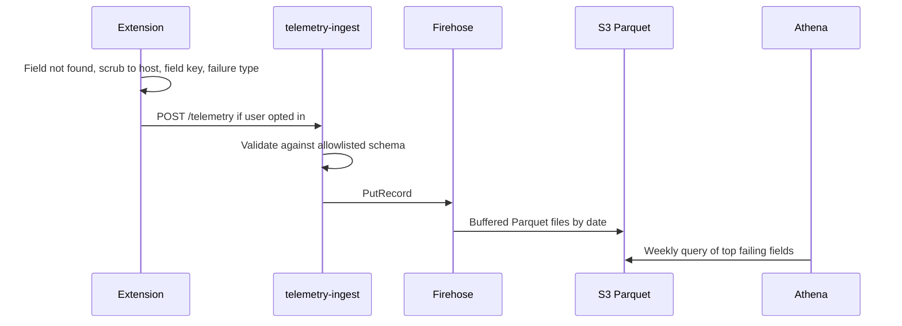

# Flow - Telemetry

Feature: [[F07 Failure Telemetry]] · back to [[00 Home]]

```mermaid
sequenceDiagram
    participant X as Extension
    participant T as telemetry-ingest
    participant F as Firehose
    participant S as S3 Parquet
    participant AT as Athena
    X->>X: Field not found, scrub to host, field key, failure type
    X->>T: POST /telemetry if user opted in
    T->>T: Validate against allowlisted schema
    T->>F: PutRecord
    F->>S: Buffered Parquet files by date
    AT->>S: Weekly query of top failing fields
```
